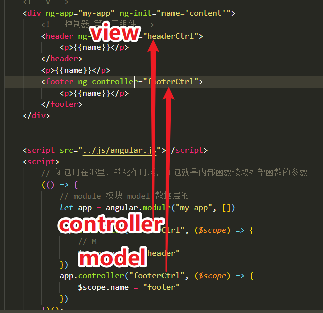

# angularjs

谷歌的MVC框架

双向数据绑定的框架

MV框架 数据层和视图层要进行绑定

[angular笔记](https://github.com/Wscats/angular-tutorial)

```html
<script src="https://cdn.bootcss.com/angular.js/1.7.8/angular.min.js"></script>
```

MVC

- Model
- View
- Controller react和vue中用组件代替了，弱化C的概念 控制

# 模块化

ng-app对应的是模块的名字，只能有一个
```js
let app = angular.module("my-app", [//引入的其他模块])
```

# 控制器


ng-app是整个angular控制的范围

使用ng-controller瓜分ng-app的作用域，控制器可以有多个

现在react和vue是没有控制器，但保留了视图和数据层，你可以使用组件来产生作用域达到封装，解耦和复用的效果



```js
let app = angular.module("my-app", [])
app.controller()
```

# 表达式

双大括号{{}}

支持字符串拼接，对象和数组的属性值，三元表达式，算法运算
```html
<p>{{name.length>2?'真':'假'}}</p>
<p>{{test(name)}}</p>
```

# 生命周期

angular1.x是没有生命周期，angular2.x有生命周期

# 指令

es6，typescript

- ng-repeat v-for
- ng-model ng-model 用于实现双向数据绑定
- ng-if ng-else-if
- ng-show ng-hide
- ng-switch


自定义指令类似组件
```html
<div ng-abc></div>
<hr />
<!-- 新版本 -->
<ng-abc></ng-abc>
```
自定义指令
```js
app.directive('ngAbc', () => {
    return {
        template: "<h1>自定义指令!</h1>"
    };
})
```

# Scope(作用域)

跟vue实例化的this很像，this给劫持了，this原则就是谁调用指向谁，this默认给指向组件。
```js
methods:{
    test(){
        this//组件
        let a = function(){
            this // 
        }
        let a = ()=>{
            this //组件
        }
    }
}
```
要去考虑this究竟指向谁

控制器里面的逻辑this指向的是window，而如果要控制数据层和视图层需要借助$scope，因为控制器而产生。

```js
// $scope局部服务
.controller('testCtrl', ['$scope', ($scope) => {
    // 不劫持this
    console.log(this)
    // 无生命周期
    let _ = $scope
    _.bool = true
    _.name = 'yao'
    _.toggle = () => {
        _.bool = !_.bool
    }
}])
```

- $rootScope
- $scope

# 过滤器

